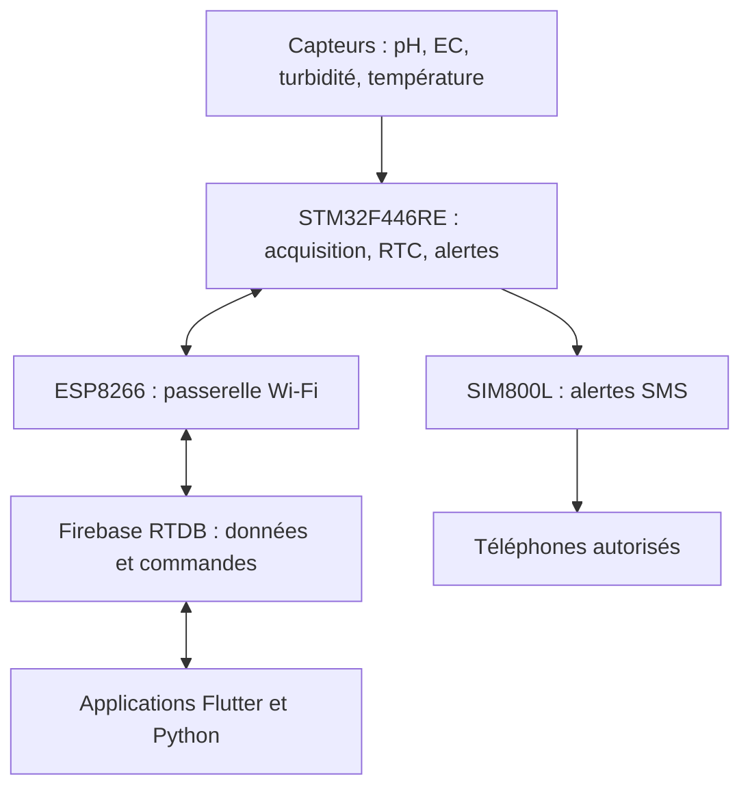

# Industrial Water Quality Monitoring System

> Système IoT de surveillance de la qualité de l'eau d'un circuit fermé de refroidissement industriel, avec supervision cloud et alertes SMS de secours.


## Sommaire

- [Présentation](#présentation)
- [Fonctionnalités](#fonctionnalités)
- [Architecture](#architecture)
- [Matériel utilisé](#matériel-utilisé)
- [Branchements](#branchements)
- [Fonctionnement](#fonctionnement)
- [Organisation du dépôt](#organisation-du-dépôt)
- [Installation et configuration](#installation-et-configuration)
- [Structure des données](#structure-des-données)
- [Alertes GSM/SMS](#alertes-gsmsms)
- [Calibration](#calibration)
- [Tests et diagnostic](#tests-et-diagnostic)
- [Sécurité](#sécurité)
- [Limites et améliorations](#limites-et-améliorations)

## Présentation

Ce projet a été développé dans le cadre d'un projet de fin d'études réalisé chez **FATAR International**. Il permet de surveiller en continu la qualité de l'eau utilisée dans le circuit fermé de refroidissement des machines d'injection plastique.

Le système mesure quatre paramètres :

- le **pH**, pour détecter une eau trop acide ou trop basique et réduire le risque de corrosion ;
- la **conductivité électrique**, pour suivre l'évolution de la concentration en ions dissous ;
- la **turbidité**, pour détecter les particules, boues, dépôts ou une perte de clarté ;
- la **température**, pour vérifier le bon fonctionnement du refroidissement.

La carte STM32 acquiert et traite les mesures. L'ESP8266 les transmet à Firebase par Wi-Fi. Les valeurs, l'historique, les alertes et les réglages sont accessibles depuis une application Flutter et un logiciel de supervision Python. Un module **SIM800L** ajoute une voie d'alerte SMS lorsque le Wi-Fi ou le cloud n'est pas disponible.

> [!IMPORTANT]
> Ce prototype fournit une aide à la surveillance et à la maintenance. Il ne remplace pas les analyses chimiques périodiques, notamment pour la dureté totale (TH), ni un dispositif industriel certifié de sécurité.

## Fonctionnalités

- Acquisition du pH, de la conductivité, de la turbidité et de la température.
- Conversion analogique sur 12 bits par le STM32F446RE.
- Lecture non bloquante du DS18B20 par bus 1-Wire implémenté avec l'USART1.
- Horodatage par RTC et périodes de mesure configurables indépendamment pour chaque capteur.
- Transmission bidirectionnelle STM32 ↔ ESP8266 à 9600 bit/s.
- Synchronisation des mesures avec Firebase Realtime Database.
- Dashboard temps réel et consultation de l'historique.
- Application mobile Flutter avec profils Admin, Opérateur et Viewer.
- Supervision PC Python avec courbes, état du système, alertes et notifications.
- Calibration guidée des sondes de pH et de conductivité.
- Commandes distantes et modification des intervalles d'acquisition.
- Détection des dépassements de seuil et retour à l'état normal.
- Alertes SMS vers plusieurs numéros avec le SIM800L.
- Modes GSM `ON`, `OFF` et `BACKUP`.
- Nouvelle tentative d'envoi sans bloquer l'acquisition des capteurs.

## Architecture



Le projet est organisé en quatre couches :

| Couche | Composants | Rôle |
|---|---|---|
| Perception | SEN0161-V2, SEN0189, sonde DJS-1, DS18B20 | Mesurer les paramètres physiques de l'eau |
| Traitement | STM32 Nucleo-F446RE | Acquisition, filtrage, calibration, horodatage, contrôle des seuils |
| Communication | ESP8266 et SIM800L | Synchronisation cloud par Wi-Fi et alertes SMS de secours |
| Middleware et application | Firebase, Flutter, Python | Stockage, historique, authentification, visualisation et configuration |

### Flux montant

1. Les capteurs fournissent les mesures au STM32.
2. Le STM32 applique la conversion, la calibration, l'horodatage et la vérification des seuils.
3. Les trames sont envoyées à l'ESP8266 par l'USART6.
4. L'ESP8266 publie les valeurs dans Firebase.
5. Les applications mobile et PC affichent les données et les alertes.
6. Si le GSM est activé, le STM32 transmet également les alertes critiques au SIM800L.

### Flux descendant

1. L'utilisateur modifie un réglage ou demande une calibration depuis une interface.
2. La commande est enregistrée dans Firebase.
3. L'ESP8266 lit la commande et la transmet au STM32.
4. Le STM32 valide puis exécute la commande sans interrompre l'acquisition.

## Matériel utilisé

| Élément | Modèle | Interface | Fonction |
|---|---|---|---|
| Microcontrôleur | STM32 Nucleo-F446RE | ADC, UART, I2C, GPIO, RTC | Unité centrale |
| Capteur de pH | DFRobot SEN0161-V2 | Analogique | Mesure du pH |
| Capteur de turbidité | DFRobot SEN0189 | Analogique | Mesure de la clarté de l'eau |
| Capteur de conductivité | Carte EC avec sonde DJS-1, K=1.0 | Analogique | Mesure de conductivité |
| Capteur de température | DS18B20 étanche | 1-Wire | Mesure de température |
| Passerelle Wi-Fi | ESP8266 NodeMCU/ESP-12F | UART, Wi-Fi | Communication avec Firebase |
| Module GSM | SIM800L | UART, réseau 2G | Alertes par SMS |
| Afficheur | LCD 16×2 avec PCF8574 | I2C | Affichage local |
| Actionneurs | Relais ventilateur et LED chauffage | GPIO | Indication/commande locale |

## Branchements

### Capteurs vers STM32F446RE

| Élément | Alimentation | Signal | Broche STM32 | Configuration |
|---|---|---|---|---|
| Turbidité SEN0189 | 5 V / GND | `AO` | `PA4` - ADC1_IN4 | 12 bits, 480 cycles, diviseur de tension obligatoire |
| pH SEN0161-V2 | 5 V / GND | `AO` | `PA5` - ADC1_IN5 | 12 bits, 480 cycles |
| Conductivité DJS-1 | 5 V / GND | `AO` | `PA6` - ADC1_IN6 | 12 bits, 3 cycles, vérifier que le signal reste ≤ 3,3 V |
| DS18B20 | 3,3 V / GND recommandé | `DATA` | `PA9` - USART1_TX | Mode half-duplex open-drain, pull-up 4,7 kΩ vers 3,3 V |

#### Diviseur de tension du capteur de turbidité

La sortie analogique du SEN0189 peut dépasser la tension maximale de l'ADC du STM32. Le montage utilisé est :

```text
SEN0189 AO ---- 4,7 kΩ ----+---- PA4 (ADC)
                           |
                          10 kΩ
                           |
                          GND
```

Avec une sortie maximale de 4,5 V, la tension appliquée à PA4 est d'environ 3,06 V :

`V_ADC = V_AO × 10 kΩ / (4,7 kΩ + 10 kΩ)`

> [!CAUTION]
> Une entrée analogique STM32 ne doit jamais dépasser 3,3 V. Mesurer chaque sortie avec un multimètre avant de la connecter. Si la carte de conductivité peut atteindre 3,4 V, ajouter un conditionnement adapté puis refaire la calibration.

### ESP8266 vers STM32

La liaison UART doit être croisée : TX d'une carte vers RX de l'autre.

| STM32F446RE | Sens | ESP8266 NodeMCU | Rôle |
|---|---:|---|---|
| `PC6` - USART6_TX | → | `D5/GPIO14` - RX SoftwareSerial | Mesures et réponses du STM32 |
| `PC7` - USART6_RX | ← | `D6/GPIO12` - TX SoftwareSerial | Commandes vers le STM32 |
| `GND` | — | `GND` | Masse commune obligatoire |

Configuration série : **9600 bauds, 8 bits, sans parité, 1 bit de stop**.

### SIM800L vers STM32

Le tableau suivant propose une liaison dédiée par **USART3** afin de ne pas perturber l'USART1 du DS18B20 ni l'USART6 de l'ESP8266. Si le firmware CubeMX utilise un autre UART, adapter uniquement les broches et le handle UART correspondants.

| STM32F446RE | Sens | SIM800L | Remarque |
|---|---:|---|---|
| `PB10` - USART3_TX | → | `RXD` | Utiliser un translateur logique ou un diviseur adapté vers le niveau logique du SIM800L |
| `PB11` - USART3_RX | ← | `TXD` | Le TX du SIM800L est généralement lisible directement par le STM32 |
| `GND` | — | `GND` | Masse commune avec tout le système |
| GPIO libre, optionnel | → | `PWRKEY` | Seulement si l'allumage logiciel est implémenté |

Configuration série recommandée : **9600 bauds, 8N1**.

#### Alimentation du SIM800L

- Fournir environ **4,0 V**, dans la plage autorisée par le module.
- Prévoir une alimentation capable de fournir des pointes d'environ **2 A**.
- Placer un condensateur faible ESR de **1000 à 2200 µF**, complété par **100 nF**, au plus près de `VCC` et `GND`.
- Utiliser des fils courts et de section suffisante ; éviter la breadboard pour l'alimentation finale.
- Ne pas alimenter le SIM800L depuis la broche 3,3 V du STM32, ni depuis une sortie incapable de fournir les pointes de courant.
- Installer une antenne GSM et une carte SIM active avec crédit SMS et couverture 2G.

### LCD et actionneurs

| Élément | Broche STM32 | Remarque |
|---|---|---|
| LCD I2C `SCL` | `PB8` - I2C1_SCL | Employer des pull-up à 3,3 V ou un convertisseur de niveau si le backpack est alimenté en 5 V |
| LCD I2C `SDA` | `PB9` - I2C1_SDA | Masse commune |
| Relais ventilateur | `PA1` | Piloter la bobine avec transistor, diode de roue libre et alimentation adaptée |
| LED chauffage | `PA0` | Ajouter une résistance série |

## Fonctionnement

### Acquisition

Les trois capteurs analogiques utilisent un ADC 12 bits en mode multicanal. Le canal actif est sélectionné par logiciel afin de respecter l'intervalle propre à chaque capteur sans mobiliser trois ADC indépendants.

Le DS18B20 est lu par une séquence 1-Wire : reset et détection de présence, `Skip ROM`, lancement de conversion, attente non bloquante, lecture du scratchpad puis calcul de la température.

Le RTC génère une interruption périodique. Les compteurs de chaque capteur activent des flags lorsque leur période est atteinte ; la mesure elle-même reste dans la boucle principale afin de garder les interruptions courtes.

### Trames série

Les trames sont terminées par un retour à la ligne. Exemples :

```text
TEMP=16.8 Time=14:05 Date=19/08/26
pH=8.10 Time=14:05 Date=19/08/26
TURB=12.4 Time=14:05 Date=19/08/26
EC=2.85 Time=14:05 Date=19/08/26
```

L'ESP8266 accepte également les variantes de clés prévues par le parseur, puis normalise les valeurs avant leur envoi vers Firebase.

Exemples de commandes descendantes :

```text
SET_TEMP_DELAY:1
SET_EC_DELAY:2
SET_TURB_DELAY:3
SET_PH_DELAY:4
```

Les délais sont exprimés en minutes. Toute commande inconnue, incomplète ou hors plage doit être rejetée sans modifier la configuration courante.

### Seuils d'alerte

Les valeurs ci-dessous proviennent du cahier de suivi présenté dans le rapport. Elles doivent être confirmées par le responsable du traitement de l'eau avant un déploiement industriel.

| Paramètre | Référence citée dans le rapport | Action |
|---|---:|---|
| pH | 7,5 à 9,5 | Alerte hors intervalle |
| Température | 13 à 18 °C | Alerte hors intervalle |
| Conductivité | < 300 µS/cm | Alerte au-dessus de la limite |
| Turbidité | Seuil à déterminer sur site | Établir une référence après calibration |
| Dureté TH | < 1 °f | Contrôle de laboratoire, non mesuré par ce prototype |

> [!NOTE]
> Certaines versions du firmware utilisent une limite de conductivité de **3,0 mS/cm**, soit **3000 µS/cm**. Les valeurs `300 µS/cm` et `3,0 mS/cm` ne sont pas équivalentes. Conserver les seuils dans une configuration unique et valider la valeur officielle avant les essais d'alerte.

Pour éviter les SMS répétés lorsque la valeur oscille autour d'une limite, le firmware doit appliquer une hystérésis, confirmer l'anomalie sur plusieurs mesures et mémoriser l'état de l'alerte.

## Organisation du dépôt

Structure recommandée pour maintenir séparément les différents sous-systèmes :

```text
water-monitoring-system/
├── firmware/
│   ├── stm32/                 # Projet STM32CubeIDE
│   └── esp8266/               # Passerelle Wi-Fi/Firebase
├── software/
│   ├── desktop-python/        # Supervision PC
│   └── mobile-flutter/        # Application Android/iOS
├── hardware/
│   ├── pcb/                   # Schémas et PCB KiCad
│   └── enclosure/             # Boîtier et fichiers mécaniques
├── docs/
│   ├── images/                # Architecture, câblage, captures
│   └── report/                # Rapport et documentation technique
├── config/
│   └── examples/              # Modèles de configuration sans secrets
└── README.md
```

## Installation et configuration

### Prérequis

- STM32CubeIDE pour compiler et programmer le STM32F446RE.
- Arduino IDE ou PlatformIO avec le support ESP8266.
- Bibliothèques ESP8266 : `ESP8266WiFi`, `SoftwareSerial` et la bibliothèque Firebase utilisée par le firmware.
- Flutter SDK et Android Studio pour l'application mobile.
- Python 3.12 pour la supervision PC.
- Dépendances Python principales : `customtkinter`, `matplotlib`, `pyrebase4`, `plyer`.
- Un projet Firebase avec Authentication et Realtime Database configurés.

### Mise en service

1. Réaliser le câblage hors tension et vérifier les alimentations au multimètre.
2. Alimenter et tester chaque capteur séparément.
3. Configurer les ADC, l'USART1, l'USART3, l'USART6, l'I2C1, le RTC et les GPIO dans STM32CubeMX.
4. Renseigner les paramètres Wi-Fi et Firebase dans un fichier local non versionné.
5. Compiler puis flasher le firmware STM32.
6. Compiler puis flasher le firmware ESP8266.
7. Créer les comptes utilisateurs et les règles de sécurité Firebase.
8. Installer les dépendances Python et lancer l'interface PC.
9. Configurer puis lancer l'application Flutter.
10. Insérer la SIM, démarrer le SIM800L et exécuter les tests AT avant d'activer les alertes.
11. Calibrer le pH, la conductivité et la turbidité avant les mesures réelles.

## Structure des données

Exemple de structure Firebase Realtime Database :

```json
{
  "capteurs": {
    "temperature": { "value": 16.8, "time": "14:05", "date": "19/08/26" },
    "ph":          { "value": 8.1,  "time": "14:05", "date": "19/08/26" },
    "turbidite":   { "value": 12.4, "time": "14:05", "date": "19/08/26" },
    "ec":          { "value": 2.85, "time": "14:05", "date": "19/08/26" }
  },
  "settings": {
    "sensor_delays": {
      "temperature": 1,
      "conductivity": 2,
      "turbidity": 3,
      "ph": 4
    }
  },
  "command": "",
  "gsm": {
    "mode": "BACKUP",
    "numbers": ["+216XXXXXXXX", "+216YYYYYYYY"]
  },
  "system": {
    "wifi": "online",
    "gsm": "registered",
    "last_update": "19/08/26 14:05"
  }
}
```

Les nœuds `gsm` et `system` sont recommandés pour centraliser la configuration et le diagnostic. Les numéros doivent être validés avant leur transmission au STM32 : format international, caractère `+`, chiffres uniquement et nombre maximal de destinataires limité par le firmware.

## Alertes GSM/SMS

### Modes disponibles

| Mode | Comportement |
|---|---|
| `OFF` | Aucun SMS ; la supervision Wi-Fi/cloud reste active |
| `ON` | SMS envoyé pour chaque nouvelle anomalie confirmée |
| `BACKUP` | SMS envoyé seulement si le Wi-Fi, Firebase ou la notification principale est indisponible |

### Séquence d'initialisation

```text
AT              -> communication avec le module
AT+CPIN?        -> SIM prête
AT+CREG?        -> 0,1 ou 0,5 attendu
AT+CSQ          -> niveau du signal radio
AT+CMGF=1       -> mode SMS texte
```

Pour envoyer un message :

```text
AT+CMGS="+216XXXXXXXX"
> Alerte : conductivite trop elevee (3.9 mS/cm), 19/08/26 14:05
<Ctrl+Z>
```

Un envoi n'est considéré réussi qu'après réception de `+CMGS:` puis `OK`. En cas de `ERROR` ou `+CMS ERROR`, le système journalise l'échec, conserve l'acquisition active et programme une nouvelle tentative, par exemple après 15 minutes. Les destinataires sont traités l'un après l'autre afin d'éviter le chevauchement des commandes AT.

### Contenu recommandé d'un SMS

- type d'événement : anomalie ou retour à la normale ;
- nom du capteur ;
- valeur et unité ;
- seuil dépassé ;
- date et heure ;
- état Wi-Fi/cloud si le GSM fonctionne en mode secours.

## Calibration

### pH

- Utiliser des solutions tampons propres, typiquement pH 4,00 et pH 7,00 ; ajouter pH 10,00 si nécessaire.
- Rincer la sonde à l'eau déminéralisée entre les solutions et l'éponger sans frotter.
- Attendre la stabilisation avant d'enregistrer chaque point.
- Tenir compte de la température fournie par le DS18B20.

### Conductivité

- Utiliser une ou deux solutions étalons couvrant la plage de fonctionnement réelle.
- Enregistrer la tension ADC et la valeur de référence pour chaque point.
- Recalculer la pente et l'offset, puis vérifier avec une solution indépendante.
- Refaire la calibration après toute modification du diviseur ou du conditionnement analogique.

### Turbidité

- Mesurer une eau claire de référence puis plusieurs échantillons connus.
- Déterminer expérimentalement la courbe et le seuil adaptés au circuit industriel.
- Éviter les bulles, la lumière parasite et les dépôts sur la partie optique.

## Tests et diagnostic

### Ordre de test recommandé

1. Vérifier toutes les tensions sans connecter les modules sensibles.
2. Tester les valeurs ADC brutes avant d'appliquer les équations de conversion.
3. Vérifier la présence et le CRC du DS18B20.
4. Observer les trames STM32 sur le port série.
5. Vérifier que l'ESP8266 reçoit chaque trame et met à jour Firebase.
6. Tester les commandes descendantes et les délais de mesure.
7. Simuler chaque dépassement et chaque retour à la normale.
8. Couper le Wi-Fi et vérifier le mode GSM `BACKUP`.
9. Envoyer un SMS vers chaque numéro configuré.
10. Tester la reconnexion Wi-Fi et l'absence de doublons après reprise.

### Diagnostic rapide du GSM

| Résultat | Signification | Vérification |
|---|---|---|
| Aucune réponse à `AT` | UART, baud ou alimentation incorrecte | TX/RX croisés, GND commun, 9600 bauds, tension stable |
| `+CPIN: NOT READY` | SIM non disponible | Sens de la SIM, code PIN, contacts |
| `+CREG: 0,0` | Non enregistré, aucune recherche active | Antenne, SIM, couverture 2G, redémarrage |
| `+CREG: 0,2` | Recherche du réseau | Attendre, vérifier antenne et alimentation |
| `+CREG: 0,1` ou `0,5` | Réseau enregistré | L'envoi SMS peut être testé |
| Signal faible avec `AT+CSQ` | Couverture ou antenne insuffisante | Repositionner l'antenne/module |
| Redémarrages pendant `CMGS` | Chute de tension lors du burst radio | Alimentation 2 A, condensateur, câbles courts |
| `+CMS ERROR` | Erreur SMS ou réseau | Lire le code, vérifier centre SMS, crédit, format du numéro et stockage |

## Sécurité

- Ne jamais publier le mot de passe Wi-Fi, la clé Firebase, les tokens API ou les vrais numéros de téléphone.
- Ajouter les fichiers contenant des secrets au `.gitignore` et fournir uniquement des fichiers `*.example`.
- Utiliser Firebase Authentication et des règles RTDB basées sur les rôles.
- Refuser côté STM32 toute commande non reconnue ou hors plage.
- Limiter la taille des trames UART et vérifier les fins de ligne pour éviter les débordements de buffer.
- Journaliser les changements de seuil, de calibration, de destinataires et de mode GSM.
- Restreindre les commandes de calibration et de configuration aux profils autorisés.

Exemple minimal :

```gitignore
# Secrets and local configuration
config.h
firebase_options.dart
.env
serviceAccountKey.json

# Build outputs
Debug/
Release/
.dart_tool/
build/
__pycache__/
*.pyc
```

Si `firebase_options.dart` est nécessaire à la compilation, ne pas le supprimer aveuglément : vérifier d'abord les recommandations Firebase pour la plateforme et protéger surtout les secrets serveur et les règles d'accès.

## Limites et améliorations

### Limites actuelles

- Le TH, les chlorures et le développement bactérien ne sont pas mesurés directement.
- Les sondes électrochimiques nécessitent une calibration et un entretien périodiques.
- La précision dépend du conditionnement analogique, du bruit électrique et de l'installation mécanique.
- Firebase et les applications distantes dépendent d'une connexion Internet.
- Les SMS dépendent de la couverture 2G, de l'opérateur, du crédit et de la qualité de l'alimentation GSM.
- Le prototype n'est pas un automate de sécurité certifié.

### Améliorations possibles

- Stockage local sur carte SD et resynchronisation après retour du réseau.
- Notifications push via Firebase Cloud Messaging en complément du SMS.
- Chiffrement et authentification des commandes embarquées.
- Mise à jour distante sécurisée de l'ESP8266.
- Isolation galvanique et PCB industriel avec protections ESD/surtension.
- Surveillance de l'alimentation et SMS de batterie faible.
- Watchdog matériel et journal de redémarrage.
- Redondance des sondes critiques et détection automatique des dérives.
- Boîtier IP65, connecteurs industriels et maintenance simplifiée des sondes.

## Références techniques

- [STM32 Nucleo-F446RE - STMicroelectronics](https://www.st.com/en/evaluation-tools/nucleo-f446re.html)
- [DS18B20 Programmable Resolution 1-Wire Digital Thermometer](https://datasheets.maximintegrated.com/en/ds/DS18B20.pdf)
- [DFRobot Gravity Analog pH Sensor/Meter Kit V2 - SEN0161-V2](https://wiki.dfrobot.com/Gravity__Analog_pH_Sensor_Meter_Kit_V2_SKU_SEN0161-V2)
- [DFRobot Gravity Analog Turbidity Sensor - SEN0189](https://wiki.dfrobot.com/Turbidity_sensor_SKU__SEN0189)
- [SIM800L Hardware Design](https://simcom.ee/documents/SIM800L/SIM800L%20Hardware%20Design_V1.00.pdf)
- [Firebase Realtime Database](https://firebase.google.com/docs/database)
- [Flutter documentation](https://docs.flutter.dev/)

## Auteur

**Nour Limem**  
Master EEA - Intégration des systèmes électroniques dédiés aux énergies renouvelables  
Faculté des Sciences de Bizerte - Université de Carthage  
Projet réalisé chez FATAR International, année universitaire 2025-2026.

## Licence

Aucune licence n'est incluse pour le moment. Sans fichier `LICENSE`, le code reste protégé par le droit d'auteur. Ajouter une licence adaptée avant d'autoriser explicitement la réutilisation ou la redistribution du projet.
